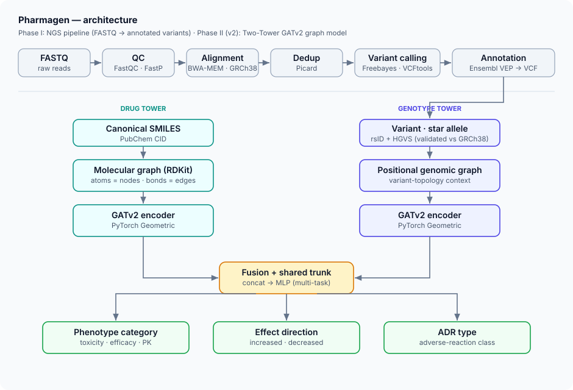

## 💊 El Problema: La Falacia de la "Dosificación Estándar"

La medicina tradicional se basa a menudo en la estadística poblacional de "talla única", asumiendo curvas de Gauss en el metabolismo que ignoran fenotipos extremos como los **metabolizadores pobres o ultrarrápidos**. En fármacos de estrecho margen terapéutico, como el **acenocumarol** o el **5-Fluorouracilo (5-FU)**, esta falta de personalización se traduce en fracasos terapéuticos o toxicidades letales.

**Pharmagen** nace para cerrar esta brecha, integrando un flujo completo desde el dato genómico crudo hasta la predicción clínica asistencial.

---

## 🗺️ Estado del proyecto

Pharmagen está pasando de **prototipo de investigación** a **software mantenible y desplegable**. Avanzan dos frentes en paralelo:

- **v1 — prototipo de investigación (completado).** Red híbrida DeepFM + Transformer entrenada sobre ClinPGx y dbSNP. Validó la hipótesis y definió el problema. Una autoevaluación posterior detectó asunciones en el tratamiento y la partición de los datos que probablemente introdujeron **fuga de información** y volvieron **optimistas** las primeras métricas: por eso las considero preliminares y no las uso como resultado definitivo.
- **v2 — en curso.** Dos líneas simultáneas: **(1) científica**, migración a una arquitectura **Two-Tower GATv2** de grafos (PyTorch Geometric); **(2) ingeniería**, refactorización completa a estándares de industria (Pydantic v2 en cada frontera, servicio FastAPI, CI con ruff + pytest, dependencias con `uv`) y un **protocolo de evaluación riguroso y sin fugas** (particiones limpias, línea base y métricas balanceadas honestas).

> El prototipo v1 demostró que la idea funciona; la v2 se centra en hacerla robusta, reproducible y evaluada con rigor.

{fig-alt="Diagrama de la arquitectura de Pharmagen"}

---

## 🧬 Fase I: Pipeline Bioinformático Orquestado

He diseñado un pipeline bioinformático modular orquestado en **Python 3.10** sobre **Debian 13 (Trixie)**. El sistema automatiza el procesamiento de lecturas masivas (NGS) garantizando la reproducibilidad mediante el gestor de entornos `uv`.

### El Flujo de Trabajo (Fase I):
1.  **Control de Calidad:** `FastQC` y `FastP` para el filtrado de lecturas de baja calidad y recorte de adaptadores.
2.  **Alineamiento:** Mapeo contra el genoma de referencia **GRCh38** mediante `BWA-MEM`.
3.  **Procesamiento de BAM:** Identificación de duplicados de PCR con `Picard (MarkDuplicates)` para evitar sesgos alélicos.
4.  **Variant Calling:** Extracción de SNPs e Indels basada en haplotipos con `Freebayes` y filtrado estricto con `VCFtools`.
5.  **Anotación Funcional:** Uso de `Ensembl VEP` en modo offline para determinar el impacto transcripcional de cada variante.

---

## 🧠 Fase II: Arquitectura DeepFM y Multi-Task Learning

Para la inferencia clínica, desarrollé una arquitectura de **red neuronal híbrida** entrenada sobre datos curados de **ClinPGx** y **dbSNP**.

### Decisiones Críticas de Ingeniería de Características:
* **Identificadores Químicos Puros:** Sustituí la clasificación ATC por **PubChem CID**. Los modelos requieren representar interacciones fisicoquímicas reales, no categorías terapéuticas abstractas.
* **Variable "Genalle":** Creación de un identificador sintético que fusiona el **rsID** con la **notación HGVS**, permitiendo una normalización alélica estricta.
* **Gestión del Desbalance:** Implementación de **Adaptive Focal Loss** y **Asymmetric Loss** para penalizar errores en efectos adversos raros pero críticos, priorizando la seguridad del paciente.

### El Modelo Matemático
La arquitectura combina **Máquinas de Factorización (FM)** para interacciones de segundo orden y un **Transformer Encoder** con mecanismos de *Self-Attention* para capturar fenómenos complejos como la **epistasia**.

$$\hat{y} = \sigma \left( w_0 + \sum_{i=1}^n w_i x_i + \sum_{i=1}^n \sum_{j=i+1}^n \langle v_i, v_j \rangle x_i x_j + y_{DNN} \right)$$

---

## 📊 Resultados y una nota metodológica honesta

La v1 se optimizó con **Optuna** (40 estudios) y **validación cruzada de 5 iteraciones**, y en las particiones internas la red aprendía la tarea multi-etiqueta de forma consistente: era una **prueba de concepto** válida de que la señal gen–fármaco es aprendible con esta representación.

Sin embargo, al revisar el flujo con más criterio detecté **asunciones en la preparación y partición de los datos** (en la normalización alélica y en la separación train/test) que probablemente **filtraron información** entre conjuntos e **inflaron** las métricas. Por eso **no publico esos números como resultado**: presentarlos como definitivos sería engañoso.

Lo que sí extraigo de la v1 es sólido: la elección de representación (PubChem CID frente a ATC, identificador `Genalle`) y el enfoque de pérdidas sensibles al desbalance funcionan. La **v2 rehace la evaluación desde cero** con particiones sin fugas, una línea base explícita y métricas balanceadas reportadas con su metodología. Cuando esas cifras estén validadas, se publicarán aquí acompañadas del protocolo que las produjo.

### El "Semáforo Rojo" Clínico
El sistema integra una variable binaria de **éxito/fracaso terapéutico**. Por ejemplo, ante una combinación de `Toxicity + Increased + Risk`, asigna automáticamente un fallo terapéutico, funcionando como un **Sistema de Soporte a la Decisión Clínica (CDSS)**. Es una capa de interpretación, no un dispositivo médico.

---

## 🚀 v2: Grafos y estándares de industria

**Frente científico.** Migración a una arquitectura **Two-Tower GATv2** con **PyTorch Geometric**: los fármacos se representan como grafos moleculares (átomos como nodos, enlaces como aristas, construidos con **RDKit**) y el genoma como grafos posicionales contextuales, capturando de forma nativa la topología biológica que los embeddings tabulares no alcanzan.

**Frente de ingeniería.** Refactorización completa hacia los estándares que la v1 no tenía: **Pydantic v2** tipando cada frontera de datos, un **servicio de inferencia con FastAPI** (OpenAPI, health/readiness probes), **CI** (ruff + pytest, ~240 tests unitarios), dependencias reproducibles con **`uv`** y el **protocolo de evaluación sin fugas** ya descrito. El objetivo: convertir un experimento funcional en software sobre el que otros puedan construir.

---

### 🛠️ Stack Técnico Detallado
* **Lenguaje:** Python 3.14 (gestionado con `uv`), Bash.
* **Deep Learning:** PyTorch, PyTorch Geometric (GATv2), Optuna, AdamW, GELU.
* **Cheminformática:** RDKit (SMILES → grafos moleculares).
* **Ingeniería:** Pydantic v2, FastAPI, pytest, ruff, CI (GitHub Actions).
* **Bioinformática:** BWA-MEM, Picard, Freebayes, VCFtools, Ensembl VEP.
* **Infraestructura:** Debian 13 (Trixie), NVIDIA RTX 4070 Ti Super (16 GB VRAM).

[Acceder al código íntegro en GitHub](https://github.com/Aderfi/Pharmagen)
